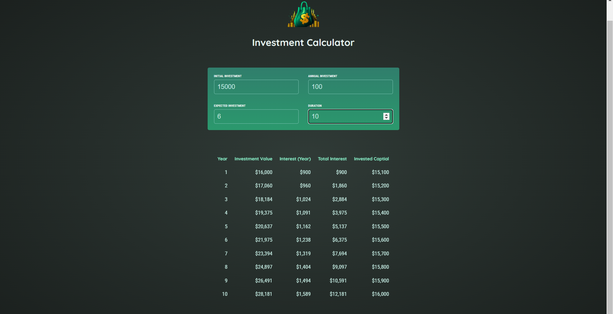
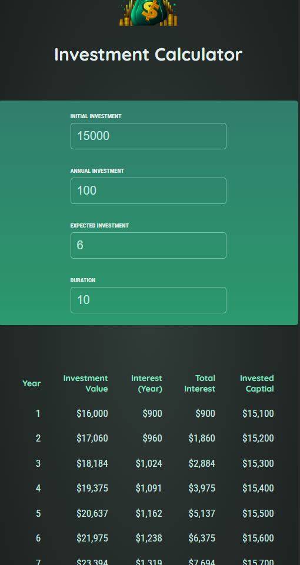

# Investment Calculator

This is a **React-based application** that helps users calculate the returns on their investments over a specified duration. By inputting the initial investment, annual investment, expected rate of return, and duration, the app calculates and displays detailed yearly data, including total investment value, yearly interest, total interest, and invested capital.

## Features

- **User Input Form**: Users can input their initial investment, annual contribution, expected rate of return, and duration for calculations.
- **Detailed Yearly Results**: Displays a table summarizing yearly data including investment value, interest, total interest earned, and capital invested.
- **Context API for State Management**: Uses React Context to manage data across components.
- **Reusable Input Components**: Clean, modular design for handling user inputs.

## Project Structure

### Key Components
1. **`UserInput`** (`UserInput.jsx`)
   - Handles user input for investment parameters.
   - Dynamically updates the state using `useContext`.
   - Uses the `InputGroup` component for a clean and reusable input interface.

2. **`Result`** (`Result.jsx`)
   - Displays a table of calculated investment results.
   - Uses React Context to access the investment data.
   - Handles cases where no data is available.

3. **`index.jsx`**
   - The entry point of the React application.
   - Wraps the application in a `DataProvider` using React Context for state management.

### Context API
- **`DataProvider`**: Provides a centralized data store for the app using React Context, enabling components like `UserInput` and `Result` to share state.

### Utilities
- **`formatter`**: Formats numbers into a user-friendly format (e.g., currency).

## ScreenShot

- Desktop view :-



- Mobile view :-



## Getting Started

### Prerequisites
- Node.js and npm installed on your system.

### Installation
1. Clone the repository:
   ```bash
   git clone <repository-url>
   ```
2. Navigate to the project directory:
   ```bash
   cd investment-calculator
   ```
3. Install dependencies:
   ```bash
   npm install
   ```

### Usage
1. Start the development server:
   ```bash
   npm start
   ```
2. Open your browser and navigate to `http://localhost:3000`.

### Build
To create a production build:
```bash
npm run build
```

## Project Tree
```
src
├── components
│   ├── UserInput.jsx
│   ├── Result.jsx
│   └── ui
│       └── InputGroup.jsx
├── dataContext
│   └── DataProvider.jsx
├── util
│   └── investment.js
├── index.jsx
└── App.jsx
```

## Technologies Used
- **React**: Component-based user interface library.
- **Context API**: For global state management.
- **CSS**: For styling the application.

